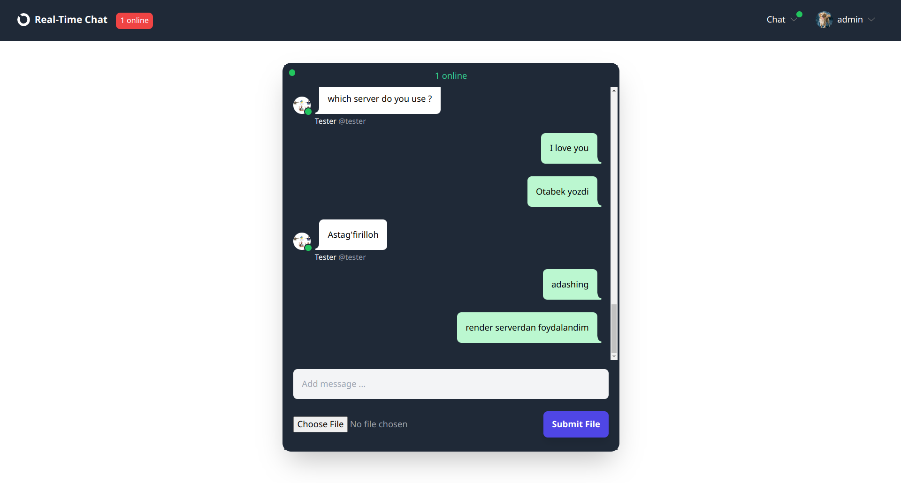
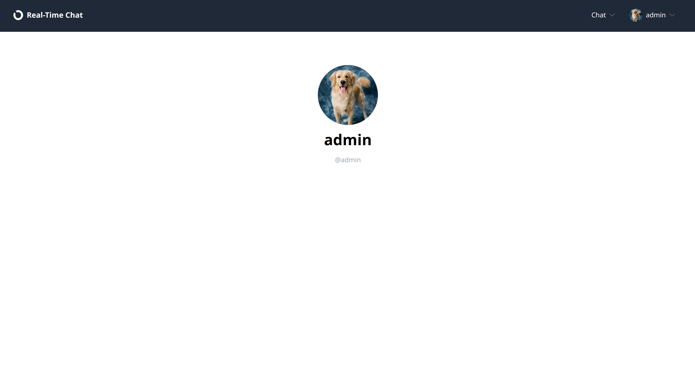
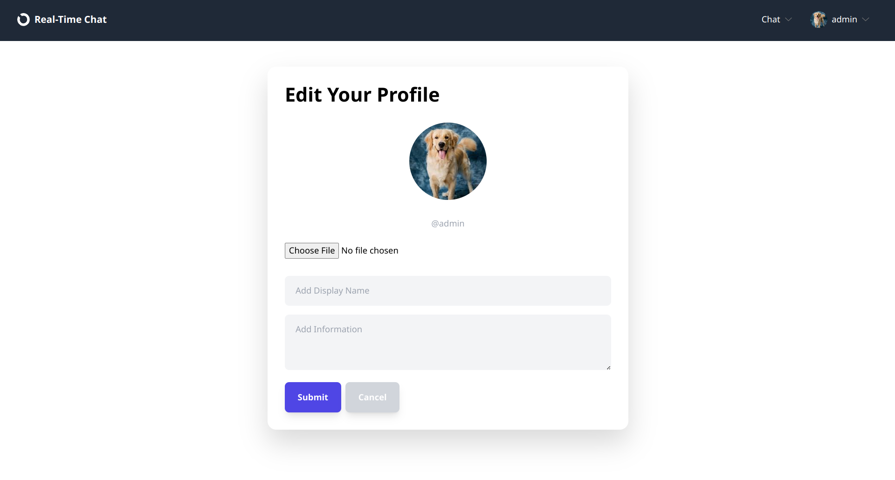
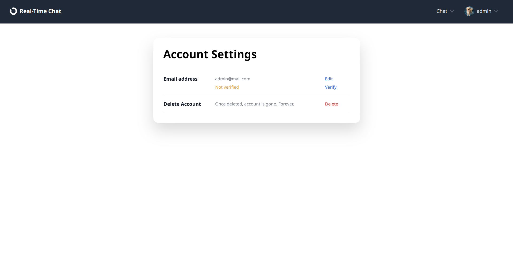
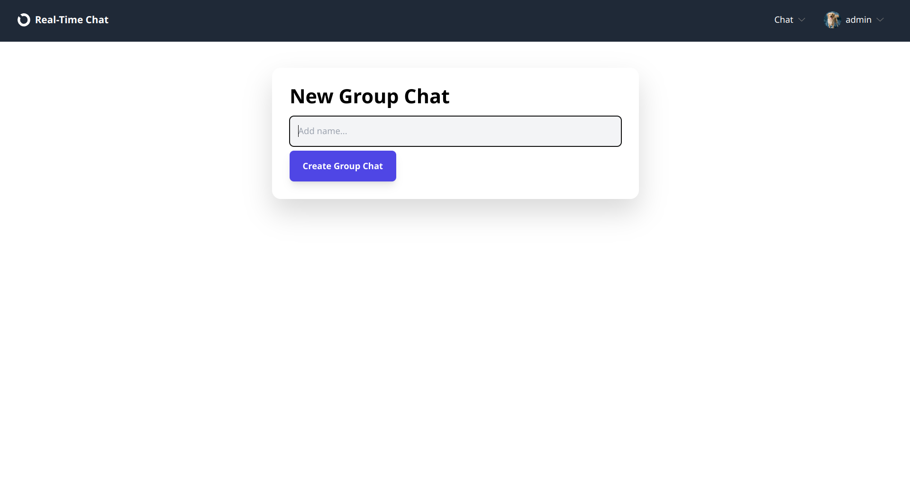
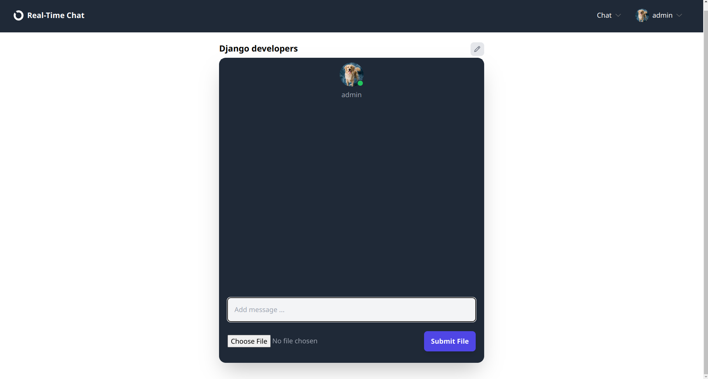

# Django Chat App
### This site is online in `https://real-time-chat-app-jxu0.onrender.com/`
## Description
### This real-time chat app is built using `django`, `django channels`, `htmx`. You can chat in real time with people from different parts of the world.
## In this chat, you can:
- ### talk to people in `public chat` section
- ### see who is online
- ### create private chat room with someone
- ### create a group of like-minded people in `group chat` section
- ### send images and gifs

## Images:

### Profile section

### Edit Profile

### Account Settings

### Creating new group chat

### Created group chat

